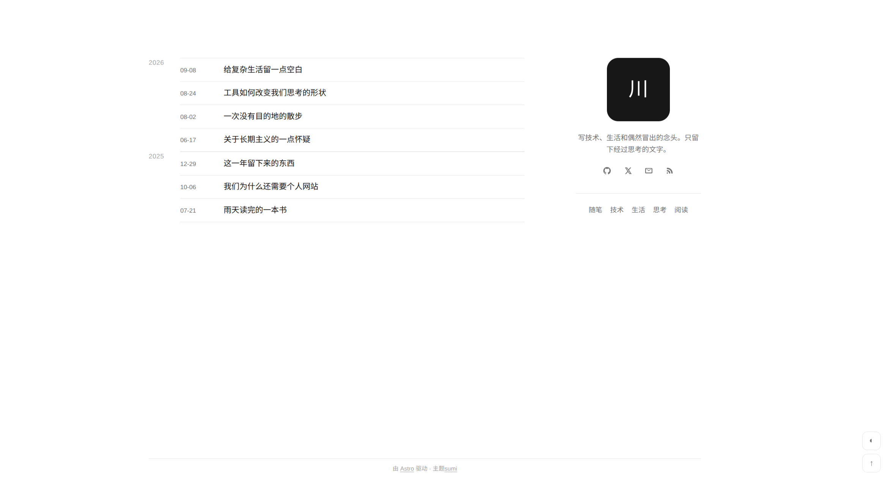
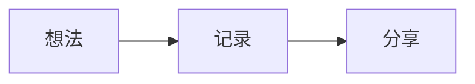

# Sumi

一个简洁、克制的 Astro 个人博客主题。

Sumi 以时间归档为页面主轴，让文章本身成为视线的焦点；侧栏只保留个人简介、社交链接与分类入口，适合持续记录技术、生活和思考。



## 特性

- 按年份分组、按时间倒序展示文章
- 在首页直接筛选分类，无需跳转或刷新
- 支持 Markdown、Shiki 代码高亮和 Mermaid 图表
- 支持浅色与深色模式，并记忆读者的选择
- 桌面端与移动端响应式布局
- 内置回到顶部按钮
- 通过 GitHub Actions 自动部署到 GitHub Pages

## 快速开始

需要 Node.js 22.12.0 或更高版本。

```bash
git clone https://github.com/chalmery/astro-theme-sumi.git
cd astro-theme-sumi
npm install
npm run dev
```

开发服务器启动后，访问终端中显示的本地地址即可预览主题。

常用命令：

```bash
npm run dev      # 启动开发服务器
npm run build    # 构建生产版本
npm run preview  # 本地预览生产版本
```

## 写一篇文章

在 `src/content/posts/` 中新建 Markdown 或 MDX 文件：

```md
---
title: 文章标题
description: 一句话介绍这篇文章
date: 2026-09-12
category: 随笔
draft: false
---

从这里开始写正文。
```

文章需要填写 `title`、`description`、`date` 和 `category`。将 `draft` 设为 `true` 后，文章不会显示在首页。

Mermaid 图表可以直接使用代码围栏：

````md

````

普通代码块由 Astro 内置的 Shiki 提供语法高亮。

## 个性化

目前主题刻意保持轻量，常用内容分布在以下文件中：

| 内容 | 文件 |
| --- | --- |
| 头像、简介、社交链接 | `src/pages/index.astro` |
| 站点标题与默认描述 | `src/layouts/BaseLayout.astro` |
| 颜色、间距与响应式样式 | `src/styles/global.css` |
| 文章字段定义 | `src/content.config.ts` |
| 站点地址与部署路径 | `astro.config.mjs` |

社交链接中的用户名和邮箱是示例内容，使用前请替换为自己的信息。

## 部署到 GitHub Pages

仓库已经包含部署工作流。推送到 `main` 分支后，GitHub Actions 会自动完成构建和部署。

首次部署前，请进入仓库的 **Settings → Pages → Build and deployment**，将 **Source** 设置为 **GitHub Actions**。

如果你 fork 了这个仓库，还需要在 `astro.config.mjs` 中修改 `site` 和 `base`，使其与自己的 GitHub 用户名及仓库名一致。

## License

[MIT](LICENSE) © chalmery
