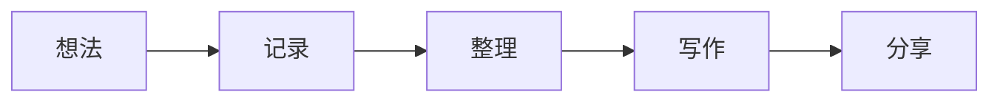

简洁不是减少一切，而是知道什么值得留下。

当生活里的选择越来越多，真正稀缺的往往不是工具，而是注意力。留白不是逃避，它让重要的事情重新浮现出来。

## 代码块

主题会为 Markdown 围栏代码提供可横向滚动的等宽排版：

```js
const keep = ["好奇心", "耐心", "一点空白"];

function simplify(things) {
  return things.filter((thing) => keep.includes(thing));
}
```

行内代码也能自然出现在正文里，例如 `npm run dev`。

## Mermaid 图表

使用 `mermaid` 代码围栏即可在文章里绘制流程图：



> 页面应该安静地承载内容，而不是与内容争夺注意力。
